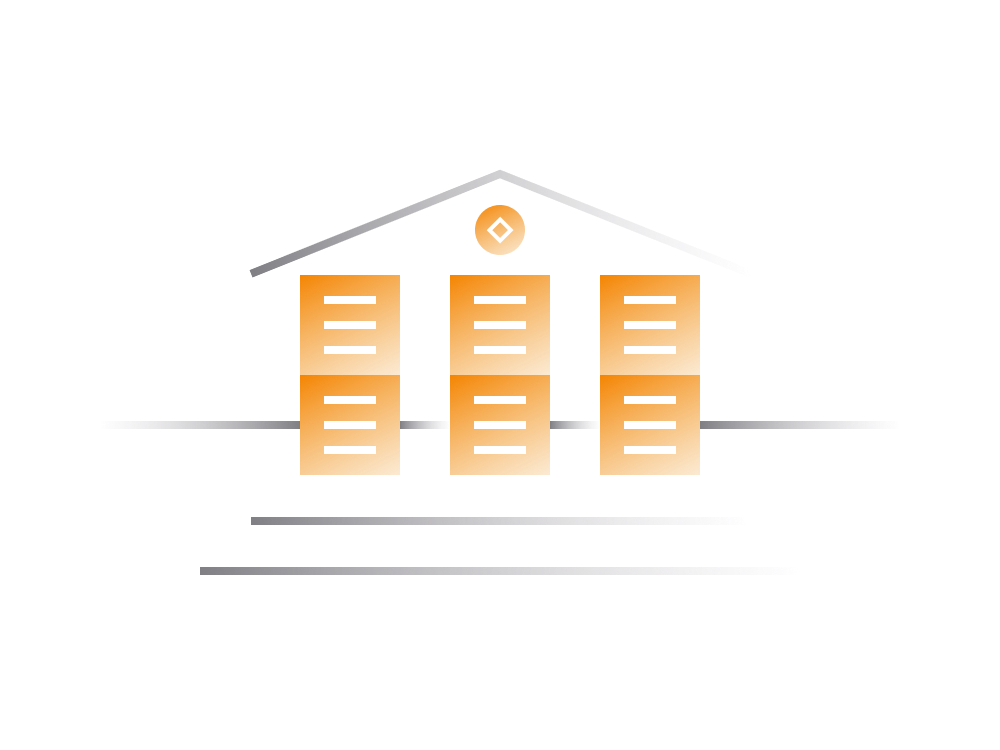

# Understanding DeFi: A Non-Technical Guide

## Introduction to DeFi:
Decentralized Finance, or DeFi, is a revolutionary category of financial services that operates without central control. Unlike traditional financial services, DeFi platforms are not governed by centralized entities, enabling users worldwide to access financial services autonomously. Generally built on Ethereum blockchain, DeFi services provide users with full control over their assets, operating 24/7.

## Key DeFi Characteristics:

- **Open Participation:**
  - Accessible to anyone worldwide with an internet connection and cryptocurrency.
  - No restrictions based on location, age, or status.

- **Censorship Resistant:**
  - Operates online 24/7, accessible globally.
  - Blockchain nodes ensure constant availability and access.

- **Non-Custodial:**
  - Users retain full control over their cryptocurrency assets.
  - No reliance on custodial entities for asset management.

- **Trustless:**
  - Services are public and open-source.
  - Code transparency ensures adherence to pre-programmed rules without misuse of funds.

## DeFi Services:
DeFi encompasses a wide range of services, mirroring traditional finance, including lending, borrowing, trading, derivatives, insurance, and more. While dealing with cryptocurrency, these services often operate similarly to traditional counterparts.

## Historical Context:

- **Bitcoin and Ethereum:**
  - Bitcoin pioneered decentralized transactions without third-party involvement.
  - Ethereum expanded capabilities by enabling conditional transactions and smart contracts.

## Growth:

- Ethereum attracted engineers, entrepreneurs, and developers to build DeFi services.
- Over 4 billion USD in value was controlled by DeFi by August 2020.

## Building DeFi:
DeFi services are created through smart contracts, outlining operational logic on the Ethereum blockchain. Key points regarding development, financing, and governance include:

- **Building:**
  - Ethereum's open nature allows the evaluation and reuse of existing code.
  - All genuine DeFi projects are open source, ensuring community trust.
  - Engineers assemble services by utilizing code from other DeFi projects.

- **Financing:**
  - DeFi projects conduct token sales (e.g., ICO) to raise funds.
  - Token sale involves selling project-specific Ethereum tokens representing voting rights or profit shares.
  - Open to anyone with cryptocurrency, offering an equivalent to public stock listing.

- **Governance:**
  - Token ownership allows participation in project governance.
  - Geographically-distributed entities govern some DeFi projects through proposals and voting mechanisms.

## Conclusion:
DeFi represents an open and decentralized financial system, challenging traditional finance. Its attributes of open participation, censorship resistance, non-custodial control, and trustlessness make it an intriguing space. Understanding its history, development, and governance provides a foundation for navigating the dynamic and rapidly evolving DeFi ecosystem. Whether for investment or exploration, venturing into DeFi requires a fundamental grasp of blockchain technology, Ethereum, and the principles driving this financial revolution.

 