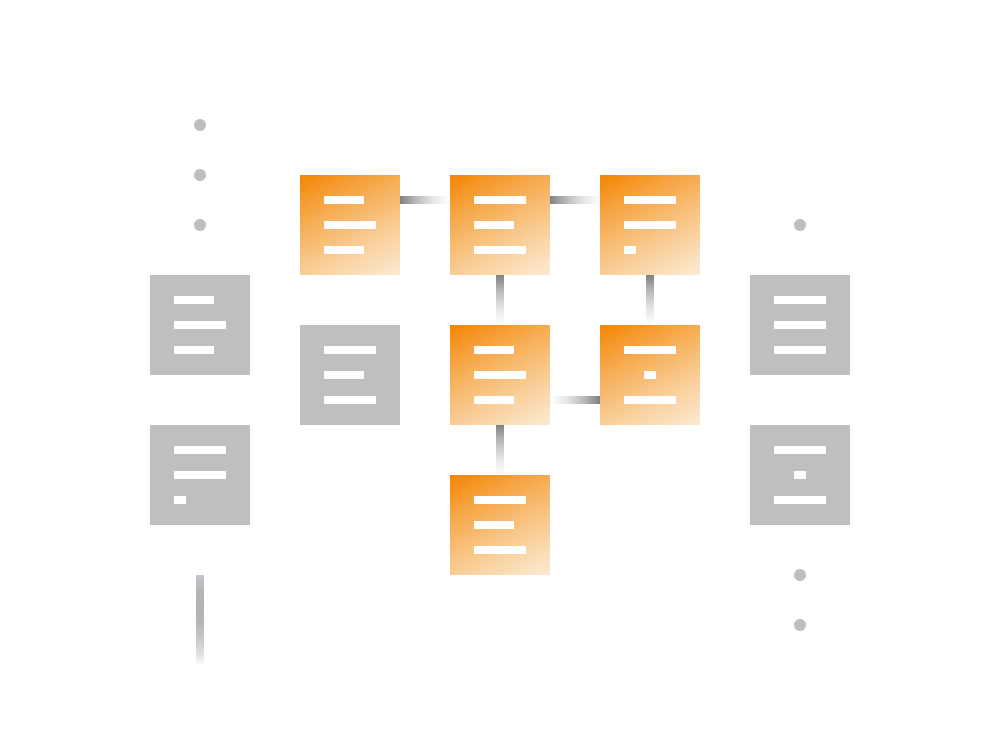

# Getting Started with DeFi: A Practical Guide

## Requirements:
To engage with most DeFi services, all you need is a working internet connection and some cryptocurrency. DeFi services are open to all, with no restrictions based on age, experience, or location.

## Tools Needed:

### Non-Custodial Wallet:

DeFi services require connecting to them using a non-custodial cryptocurrency wallet.

**Common choice:** Metamask (available as a Chrome extension).

#### Setting Up Metamask:

1. Install Metamask from its [website](https://metamask.io/) and choose the extension for your browser.
2. Click "Get started" and create a new wallet by adding a password.
3. Safely backup the unique 12-word representation of your private key provided.
4. Your Metamask wallet is now ready for use.

### Getting Funds:

Deposit funds from another wallet into your Metamask wallet.

### Connecting to DeFi Services:

1. Visit the website of the desired DeFi service.
2. Look for 'connect wallet' or similar options.
3. Connect your Metamask wallet to the DeFi service.

## DeFi Security & Risks:

### Security:

- Majority of DeFi services operate in a non-custodial manner, ensuring users' direct control over funds.
- Security is guaranteed by smart contracts, and user assets cannot be interfered with externally.

### Risks:

- The DeFi field is young, and potential undiscovered security issues may exist.
- Not all services undergo extensive third-party audits, exposing unaudited services to hacking risks.
- Never invest more than you're willing to lose due to potential vulnerabilities.

## DeFi Insurance:

- Some projects, like Nexus Mutual, offer insurance against vulnerabilities in DeFi smart contracts.
- Users can purchase insurance for various DeFi products and receive compensation if the product is hacked.

## DeFi Privacy:

- DeFi projects built on Ethereum expose your Ethereum address, revealing transaction history and token balances.
- Use multiple wallets to mitigate privacy concerns:
  - Storage Wallet: Safely store Ethereum tokens.
  - Generic Wallet: For transactions with known entities.
  - DeFi Transactions Wallet: Specifically for DeFi transactions.

## DeFi Transactions:

- DeFi transactions are typically more expensive than regular transactions due to increased computational steps.
- Transaction fees are higher as they correlate with computational resources needed for execution.
- Consider using DeFi for larger sums due to transaction cost implications.

## Conclusion:

Getting started with DeFi is relatively straightforward, requiring a non-custodial wallet and access to DeFi service websites. Metamask is a popular choice for wallet connectivity. However, users should be mindful of security risks, consider insurance options, and manage privacy concerns by using multiple wallets. DeFi transactions can be costlier, making them more suitable for larger sums. Understanding these practical aspects enhances your readiness to explore and engage with the evolving world of Decentralized Finance.
