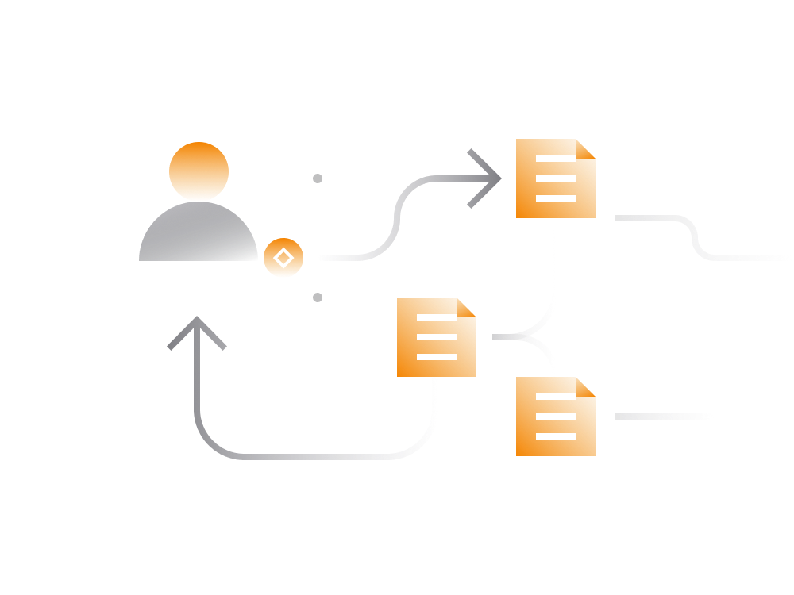

# Understanding DeFi Transactions:

## 1. Transaction Complexity:

- **Flexibility:**
  DeFi transactions are highly flexible, allowing for a wide range of conditional logic and steps.

- **Programmability:**
  Often referred to as "programmable money," DeFi transactions can include numerous steps. For instance, a transaction involving an ETH flash loan, multiple decentralized exchanges (DEX), and asset conversions.

- **Interoperability:**
  DeFi smart contracts are interoperable, enabling users to programmatically connect multiple DeFi services, creating complex transactions.

## 2. Transaction Fees:

- **Comparison:**
  DeFi transactions are generally more complex and, therefore, require higher processing fees compared to generic Ethereum transactions.

- **Potential Solutions:**
  The issue of high fees might be addressed as Ethereum's capacity expands or by using alternative blockchains like Solana, Avalanche, Algorand, which can execute transactions more efficiently.

- **Cost Factors:**
  DeFi transaction costs are influenced by the growing popularity of DeFi services and Ethereum's transaction limitations.

## 3. DeFi Service Fees:

- **Service Charges:**
  DeFi services typically charge small fees for their services, such as decentralized exchanges charging traders for each trade.

- **Components:**
  Fees include a service fee paid to the DEX smart contract and transaction fees for Ethereum network nodes.

## 4. Approval Transactions:

- **Significance:**
  Many smart contracts require user approval to access their capital. An approval transaction is necessary to grant permission for spending a specific amount of a token.

- **Common Practice:**
  Most DeFi services mandate an approval transaction before users can utilize the service.

## 5. DeFi Privacy:

- **Address Exposure:**
  DeFi projects built on Ethereum inherit Ethereum's privacy level. All DeFi transactions expose the associated Ethereum address.

- **Tip for Mitigation:**
  To enhance privacy, users can consider using multiple Ethereum wallets:
  - For Asset Storage: Safely stores Ethereum tokens without engaging in transactions.
  - For Generic Payments: Used for general transactions with people.
  - For DeFi Transactions: Dedicated wallet for DeFi transactions, minimizing exposure to known entities.

## 6. Conclusion:

- **Experimentation:**
  Anyone can experiment with DeFi transactions using personal cryptocurrency or flash loans, especially for those with limited access to capital.

- **Ongoing Development:**
  As the DeFi ecosystem evolves, transaction complexities, fees, and privacy considerations may continue to be refined and adapted to address user needs and challenges.
