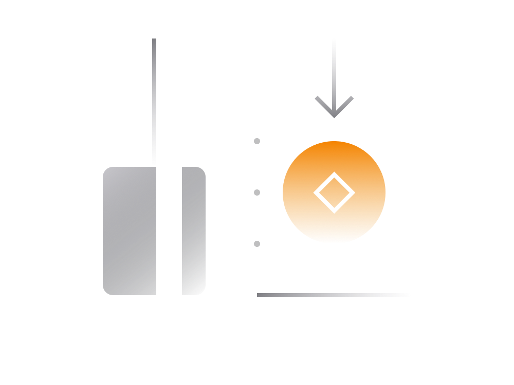

# Buying Cryptocurrency: A Comprehensive Guide

Now that you have a solid grasp of cryptocurrency basics and wallet usage, let's delve into various methods of acquiring cryptocurrencies, catering to different preferences and needs.

## Buying With Credit Card:

- Convenient for smaller amounts.
- Premium fees may apply.
- Trusted platforms include Binance.com, Cex.io, Changelly.com, Coinbase.com, and Coinmama.com.
- Ideal for EU and US residents, but availability may vary in other regions.

## Buying On Exchange:

- Suitable for larger amounts.
- Offers competitive prices compared to credit card purchases.
- Reputable exchanges include Binance.com, Coinbase.com, Cex.io, Kraken.com, and Coinmama.com.
- Involves creating an account, identity verification, fund transfer, cryptocurrency purchase, and withdrawal to a wallet.
- Adheres to Know Your Customer (KYC) and Anti-Money Laundering (AML) checks.

## Getting Paid In Crypto:

- Freelancers and online service providers can accept cryptocurrency payments.
- Services like BitPay.com or Coinbase offer payment solutions.
- DIY options like BTCPayServer are available for those familiar with programming.
- Non-custodial wallets can directly receive payments.

## Buying Via P2P Platform:

- Buying with cash from someone you know.
- Requires a non-custodial wallet.
- Platforms like LocalBitcoins.com and Bisq connect buyers and sellers for peer-to-peer exchanges.
- Caution: Risks involved; verify the legitimacy of the selling party.

## Buying On Decentralized Exchange (DEX):

- Utilizes blockchain technology for direct peer-to-peer exchanges.
- Generally secure and private.
- Works primarily for Ethereum and Ethereum-based tokens.
- DEX platforms include KyberSwap (https://kyberswap.com) and Uniswap (https://uniswap.exchange).
- Challenges: Limited support for non-Ethereum assets, no fiat deposits/withdrawals, lower liquidity, technical complexity.

While each method has its pros and cons, choosing the right approach depends on factors like transaction volume, desired privacy, and familiarity with the cryptocurrency landscape. Beginners may find credit card purchases or exchanges more accessible, while advanced users might explore the privacy-focused options of decentralized exchanges. Always exercise caution and research thoroughly, especially when dealing with peer-to-peer transactions.
