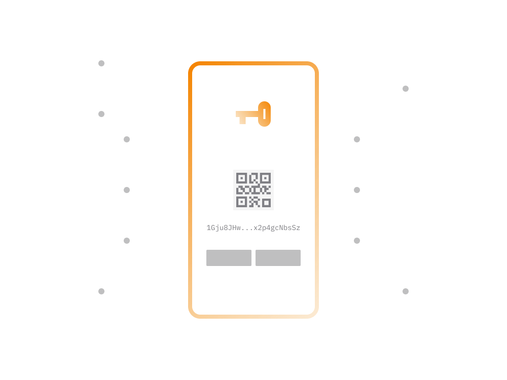

# Private Keys

As previously discussed, genuine cryptocurrency wallets store cryptographic keys that control specific amounts of cryptocurrency.

The private key, often referred to as the cryptographic key, is stored within the wallet app. This key grants the user control over a designated amount of cryptocurrency.

> **The non-custodial wallet app utilizes the private key to fetch cryptocurrency balances and past transactions from the blockchain.**

We won't delve into the technical details of how private keys work; suffice it to say that the term private key refers to the cryptographic key mentioned earlier.

Let's explore the security aspects of private keys for a more comprehensive understanding.

## 1. Keep Key Private

Scammers often attempt to trick users, posing as wallet support teams, to share their private keys. Sharing the key enables scammers to steal funds.

> **As a wallet app user, there is no valid reason to share your private keys with anyone. This applies to all types of wallets.**
>
> **Never disclose your private key, even when communicating with the developers of your wallet app.**

Sharing your private key should only occur when intentionally transferring ownership, a process facilitated by most non-custodial wallets.

## 2. Backup Private Key

During the setup of most non-custodial wallet apps, users are prompted to write down the private key and store it offline.

> **The private key is crucial for restoring wallet access if the device with the wallet app becomes inaccessible (e.g., stolen or non-functional).**

To simplify backup, private keys are often converted into a set of 12 or 24 regular words.

Ensure accurate backup without typos, as the correct order of the words is vital.

> **Loss or exposure of the private key allows unauthorized control over your cryptocurrency.**

## 3. Private Key Generation

When setting up a non-custodial wallet app, the code generates a secure private key. For security, the key must be truly random, validating the safety of non-custodial wallets.

> **Non-custodial wallets keep their code open for scrutiny, allowing third-party engineers to verify the randomness of private key generation.**

Websites like [WalletScrutiny.com](https://walletscrutiny.com) verify whether wallets on Google Play use publicly shared code.

## 4. One Key, Many Coins

A single private key can control balances for multiple cryptocurrencies. Wallet apps using such keys can automatically locate balances for all supported cryptocurrencies.

## 5. Balances & Transactions

Private key standards dictate how wallet apps handle keys for multiple cryptocurrencies. The private key is used to derive payment addresses for each cryptocurrency.

> **Your wallet app uses the private key to derive payment addresses, allowing others to pay you in cryptocurrency.**

The wallet app, by examining the private key, can derive unique addresses for Bitcoin, Ethereum, and other cryptocurrencies.

> **A standard-compliant private key allows different wallets to correctly derive payment addresses and transactions for each supported cryptocurrency.**

## 6. Moving Between Wallets

Good non-custodial wallets support private key migration between apps. A private key created on one non-custodial wallet should be compatible with others.

> **Users should not be confined to a single wallet provider and should easily migrate between non-custodial wallet apps from different developers.**

When migrating a private key, the destination wallet must support all cryptocurrencies controlled by that key.

> **Choose a wallet that is standard compliant and supports the import/export of private keys.**

Note: Ensure the destination wallet supports all cryptocurrencies your private key controls to access the full balance.
