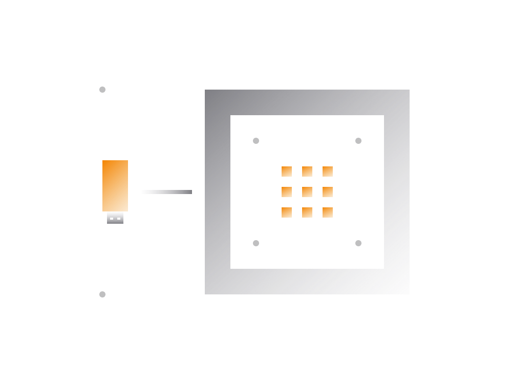
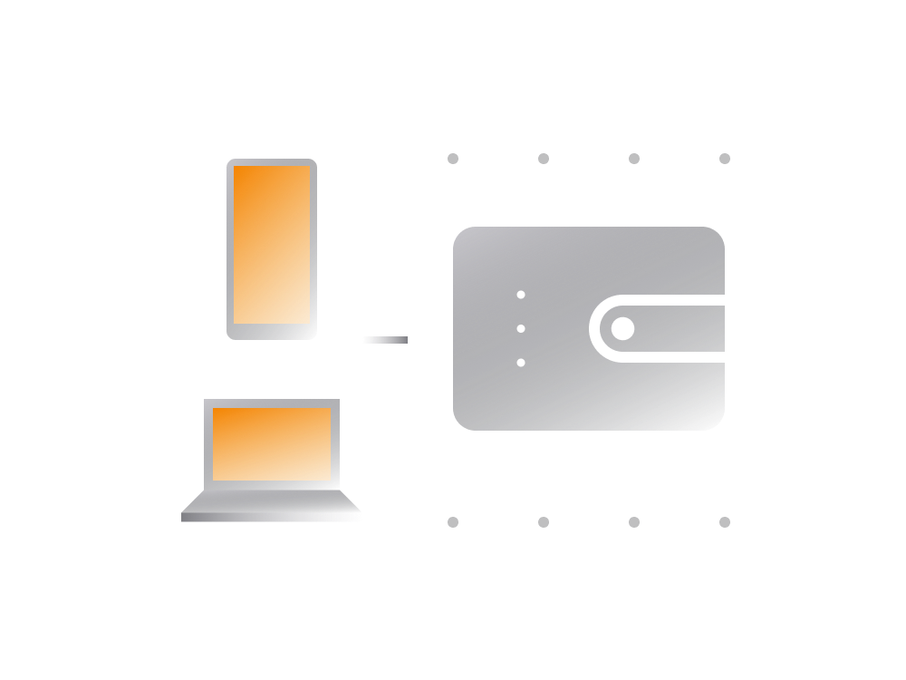

# Safe Storage

Let's explore different types of non-custodial wallets, recognizing that there isn't a one-size-fits-all solution. The suitability of a wallet depends on factors such as security familiarity, cryptocurrency amount, access frequency, potential targeting, and geographical location.

## Non-custodial Wallet Types

All non-custodial wallets grant users full control over their crypto. Three main types include:

1. **Hardware Wallets:** Small USB-like devices engineered to securely store large amounts of cryptocurrencies. Considered highly secure due to physical extraction prevention.

    - [Trezor](https://trezor.io)
    - [Ledger Wallet](https://www.ledgerwallet.com)

2. **Mobile Wallets:** Common non-custodial wallet apps for iOS and Android. Generally user-friendly but potentially less secure than hardware wallets.

3. **Desktop Wallets:** Software wallets for desktops, theoretically less secure than mobile wallets due to larger potential attack surface.

    - [Electrum](https://electrum.org)
    - [Exodus](https://www.exodus.io)

## So, Which Wallet?

Consider private key security but don't overlook other factors. Privacy, ease of use, and potential exposure of personal data are crucial. A tiered approach, increasing security as risk grows, is recommended.

- **Security Basics:**
    - Basic digital security knowledge.
    - Clean and updated mobile OS.
    
- **Standard Compliant:**
    - Wallets generating private keys per security standards.
    - Enables seamless migration if needed.
    
- **Unauthorized Access:**
    - PIN or similar protection for wallet device.

## Multiple Wallets

As crypto capital grows, introduce additional security measures like splitting funds into multiple wallets.

- **Generic Wallet:**
    - Mobile or desktop wallet for everyday transactions.
    
- **Investment Wallet:**
    - Mobile wallet for active investments.
    
- **Cold Storage Wallet:**
    - Hardware wallet for long-term storage.

## Wallet Backup Tips

Critical to have a backup of the private key. Consider how and where you store the backup:

- **Optional Password:**
    - Some wallets allow an optional password for added security.
    - Memorize or store the password separately.
    
- **Offline Backups:**
    - Keep private key backups separate from wallet devices.
    - Use metal containers for word backups.
    - Share recovery information with trusted individuals.

## Conclusion

Understanding non-custodial wallets and their security is crucial. These wallets guarantee ownership of held cryptocurrencies, unlike custodial wallets provided by exchanges. For significant crypto holdings, consider a tiered approach with a substantial portion on a hardware wallet.

