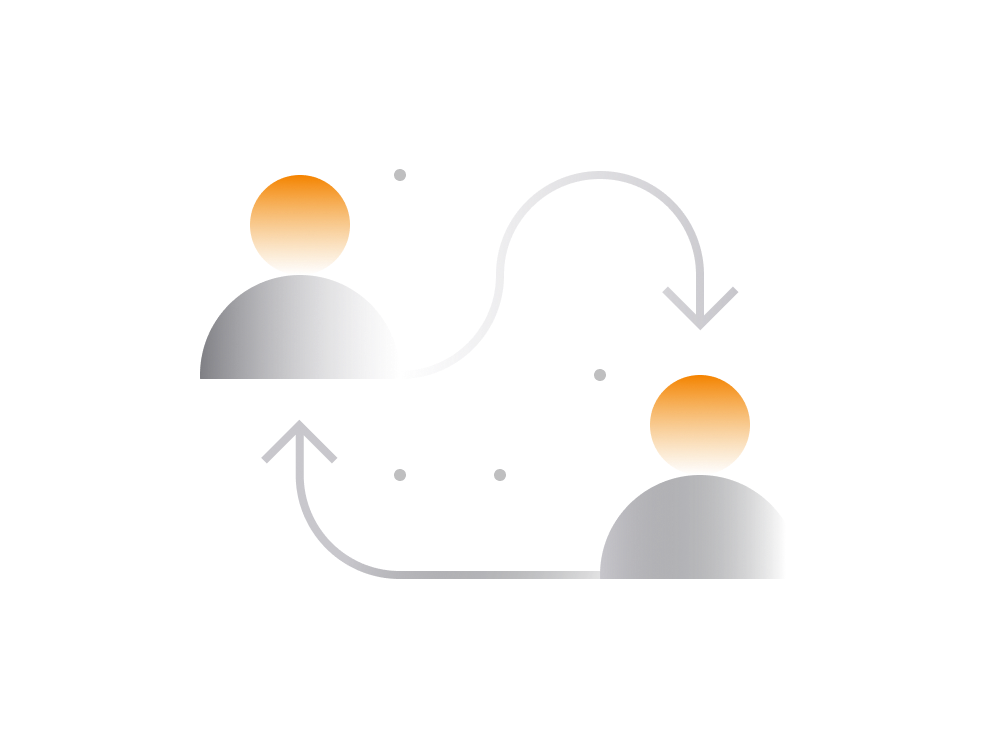

# Transactions Unveiled

Dive into the intricacies of cryptocurrency transactions and unravel the nuances of sending and receiving digital assets.

## Send & Receive Crypto

Sending and receiving crypto share a similar process across various wallets:

- **To Send Crypto:**
  
    Within your wallet app, locate the "send" option. If the wallet supports multiple currencies, ensure the correct cryptocurrency is selected. Input the amount, recipient's address, transaction fee, and click "send."

- **To Receive Crypto:**

    Open the wallet app, find the "receive" option, and copy the recipient's address. Some cryptocurrencies offer unique addresses for each transaction, while others use a consistent address.

## Transaction Phases

Cryptocurrency transactions undergo several phases:

1. **Transaction Is Pending:**

    Once sent, the transaction swiftly reaches the blockchain network. Both sender and recipient can monitor its status through wallet apps or public blockchain explorers.

2. **Transaction Gets Confirmed:**

    Valid transactions are raced by blockchain nodes to be added to the blockchain. Confirmation times vary between blockchains, with Bitcoin taking around 10 minutes and Ethereum approximately 2-3 minutes.

3. **Transaction Is Final:**

    After being added to the blockchain, the transaction is considered final. For significant sums, waiting for multiple blocks (up to 6) is recommended for added security.

## Transaction Fees

Sending cryptocurrencies like Bitcoin or Ethereum incurs transaction fees. This fee compensates the node that first adds the transaction to the blockchain. It serves as a service fee for utilizing the network.

Transaction fees vary among cryptocurrencies. While some have minimal fees, others like Bitcoin may exceed $1. The fees help prioritize transactions, with lower fees resulting in longer processing times.

Wallets, such as Unstoppable, often recommend optimal transaction fees based on current network activity. When dealing with substantial sums or time-sensitive transactions, consider providing a fee higher than the average to ensure prompt processing.

## Cancelling Transaction

In certain situations, transactions may need cancellation, usually while still pending. Bitcoin and Ethereum transactions can be modified during this phase if supported by the wallet. Once added to the blockchain, cancellations become impractical.

## Transaction Privacy

Understanding transaction privacy is crucial. While transactions on most blockchains are publicly visible, some privacy-focused cryptocurrencies, like Monero or Zcash, conceal transaction details.

- **Bitcoin Privacy:**

    Bitcoin wallets encourage generating new addresses for each transaction to enhance privacy. Reusing addresses may compromise user privacy, revealing transaction histories.

- **Ethereum Privacy:**

    Ethereum wallets typically use a single address for receiving payments, exposing transaction details publicly. To mitigate this, it's advisable to use separate wallets for transactions and asset accumulation.

To sum up, Bitcoin transactions currently offer more privacy than Ethereum. Always prioritize privacy considerations, especially when dealing with substantial sums or sensitive transactions.

