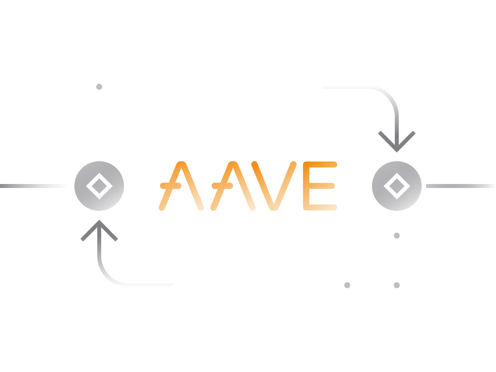

# Aave Simplified

[Aave](https://app.aave.com/) is a decentralized Ethereum-based service that facilitates lending and borrowing of Ethereum-based cryptocurrency assets without the need for a custodian.

## Overview

Launched in January 2020, Aave gained significant traction, attracting nearly $2 billion USD worth of cryptocurrencies within 8 months.

- **Depositors** contribute liquidity by depositing cryptocurrencies into decentralized lending pools and earn interest.
  
- **Borrowers** access loans from these pools, incurring a fee. Notably, Aave allows borrowing without collateral, distinguishing it from platforms like [Compound](../../token_guides/en/compound.md) or [MakerDAO](../../token_guides/en/makerdao.md).

- Aave's smart contracts are non-custodial and decentralized, ensuring the Aave team has no access to user funds.

## Supported Assets

As of September 2020, Aave supports lending and borrowing for 20 Ethereum-based cryptocurrency tokens, each with its own requirements.

For a detailed list, visit Aave's [Reserve Overview](https://app.aave.com/).

## Lending on Aave

Cryptocurrency owners can lend supported assets to Aave and earn interest. Key points:

- Lending rates and risk-related parameters vary between assets.
  
- Deposits are secured by collateral provided by borrowers.

- Lenders receive interest-earning aTokens, pegged 1:1 to the deposited asset's value.

## Borrowing on Aave

Borrowing requires collateral in another supported cryptocurrency. Important details:

- Borrowing terms vary; Loan-to-Value ratio determines maximum borrowing power.
  
- Borrowers choose fixed or variable interest rates, with variable rates often lower but subject to market changes.

- Collateral value must remain above the minimum to avoid automatic sale by the Aave protocol.

## Flash Loans

Aave stands out with its "Flash Loans" feature:

- Allows borrowing without collateral within a single transaction.
  
- Primarily accessible to programmers for activities like arbitrage and refinancing.
  
- A 0.09% fee is charged on flash loans.

## Aave Governance

Aave is transitioning to a fully community-governed DAO:

- The AAVE token facilitates voting on protocol improvements.
  
- Token holders can propose and vote on adding new assets with risk parameters.

- AAVE token holders receive incentives, such as a share of protocol fees.

- AAVE tokens are deflationary, as protocol earnings are used to buy and burn tokens.

## Aave 2.0

[Aave 2.0](https://medium.com/aave/aave-v2-the-seamless-finance-d52075d97a70),
