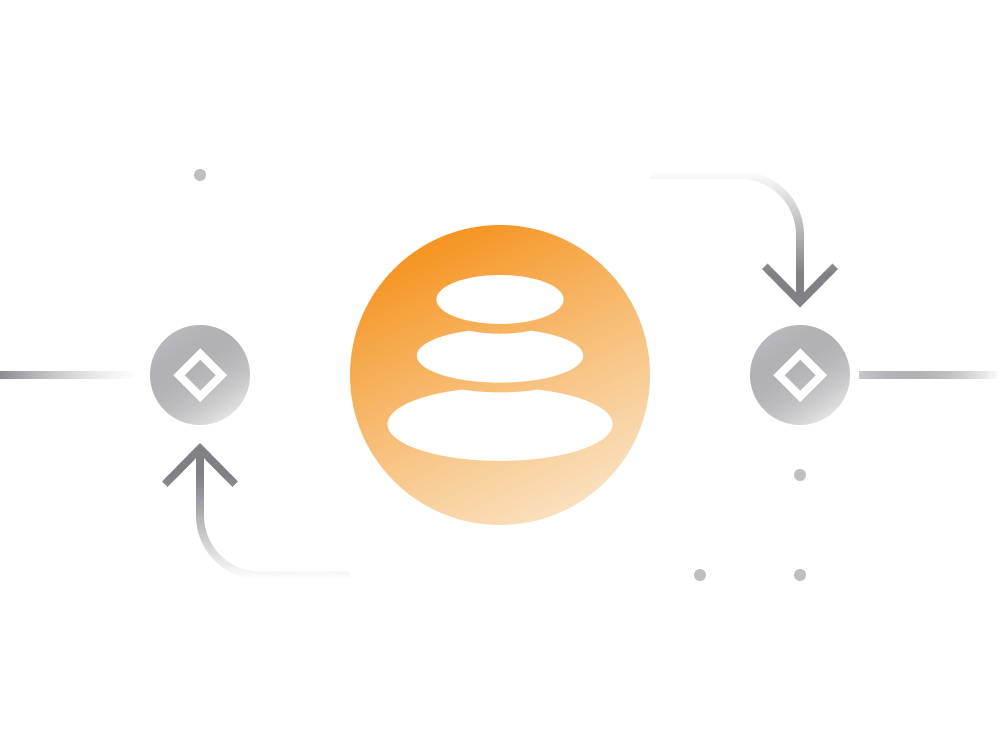

# Balancer Simplified

## 1. Introduction

- **Launch Date:** Balancer, a decentralized exchange, was launched in March 2020.

- **Origin:** Initiated as a research project by BlockScience in early 2018, it evolved into the Balancer protocol.

- **Framework:** Balancer's mathematical framework allows continuous portfolio self-rebalancing, generating fees.

- **Token:** BAL, the native token, governs Balancer's economics.

## 2. Trading on Balancer

- **Decentralized Exchange:** Balancer functions as a decentralized platform for trading Ethereum and ERC20 tokens.

- **Order Processing:** For each order, Balancer evaluates all available pools containing the requested tokens, optimizing order execution for the best possible price.

- **Fees:** Trading fees vary among pools, and slippage (deviation from market price) increases with larger order amounts.

- **Incentives:** Balancer incentivizes liquidity providers with BAL tokens, encouraging them to keep fees low.

## 3. Providing Liquidity

- **Flexible Opportunities:** Users earn fees on idle Ethereum-based assets.

- **Pool Types:** Different liquidity pool types allow users to create or contribute to existing pools with 2-8 assets.

- **Auto-Balancing:** Pools automatically maintain specified asset ratios, and liquidity providers receive pool ownership tokens (ERC-20 tokens) for future withdrawals.

- **Transaction Fees:** Each pool has its fee policy, with lower fee pools receiving more distributed BAL tokens.

- **Setting up Pools:** Creating a new pool may incur Ethereum transaction fees, especially during network congestion.

## 4. Pool Types

- **Shared Pools:** Immutable pools open to anyone.

- **Private Pools:** Creator-controlled pools with limited contributors.

- **Smart Pools:** Smart contract-owned private pools with potential restrictions.

## 5. Index Funds

- **Unique Feature:** Balancer enables users to create self-balancing index funds.

- **Earning Fees:** Liquidity providers earn fees as other users trade against their deposited portfolio.

- **Flexibility:** Users can create or invest in self-balancing index funds, simplifying long-term cryptocurrency investments.

- **Permissionless:** Balancer's permissionless nature prevents censorship, smart contract edits, or shutdowns once activated.

## 6. Balancer Token (BAL)

- **Rewards:** BAL tokens started being distributed to liquidity providers on June 1, 2020, in addition to pool fees.

- **Governance:** BAL serves as the governance token for the Balancer protocol, with a total supply of 100 million BAL tokens.

- **Distribution:** 25 million BAL tokens allocated to founders, devs, advisors, and investors, while 75 million BAL tokens are designated for distribution to liquidity providers.

- **Governance Model:** Details about the governance model and token distribution are explained in the project's blog.

## Links

- [Project Whitepaper](https://balancer.finance/whitepaper/)
- [Official Blog](https://balancer.finance/blog-feed/)
- [Balancer Pool Management](https://pools.balancer.exchange/#/)
