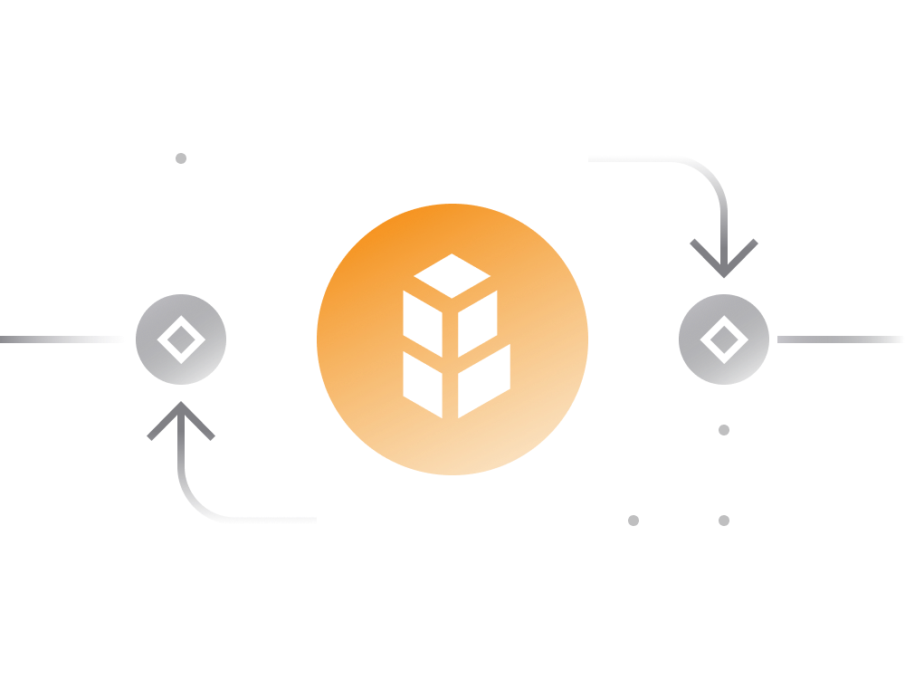

# 5. Bancor Decentralized Exchange (DEX)

[Bancor](https://www.bancor.network/) stands as a decentralized exchange (DEX) similar to Uniswap, offering an alternative platform for trading Ethereum-based tokens.

Bancor introduces its native token, Bancor Network Token (BNT). Traders using Bancor aren't obligated to hold BNT, but those involved in creating or providing liquidity to a pool on Bancor must possess BNT.

## Additional Incentives for Liquidity Providers:

- **Bancor V2:** Simplifies liquidity provision by enabling providers to enter a liquidity pool with just one token, eliminating the two-sided liquidity deposit requirement.

- **Accumulation of Value:** Similar to other DEX platforms, Bancor liquidity pool tokens can accumulate value through trading fees.

- **Additional Rewards:** Liquidity providers can receive rewards from the Bancor Protocol (via BNT token inflation) and from projects supporting the tokens through 'liquidity provider incentive programs.'

- **BNT Reserves:** Each Bancor liquidity pool holds BNT in its reserves, with BNT acting as the intermediary token connecting pools in the network and across blockchains. For example, a trade from DAI to BAT follows this conversion path: DAI > BNT > BAT.

For more detailed information about Bancor and its mechanics, refer to the [official documentation](https://support.bancor.network/hc/en-us/sections/360000256751-Bancor-Network).

In July 2018, Bancor faced a security breach resulting in the loss of $23.5M in crypto assets (a mix of ETH, NPXS, and BNT). This incident involved a hack of a wallet used for smart contract upgrades. Bancor responded promptly by temporarily shutting down the exchange and freezing the BNT, although they had no control over the lost ETH and NPXS. This event raised concerns about the genuine decentralization of entities claiming to be part of decentralized finance (DeFi). Charlie Lee, creator of Litecoin, publicly criticized Bancor, stating that "An exchange is not decentralized if it can lose customer funds OR if it can freeze funds. Bancor can do both."
