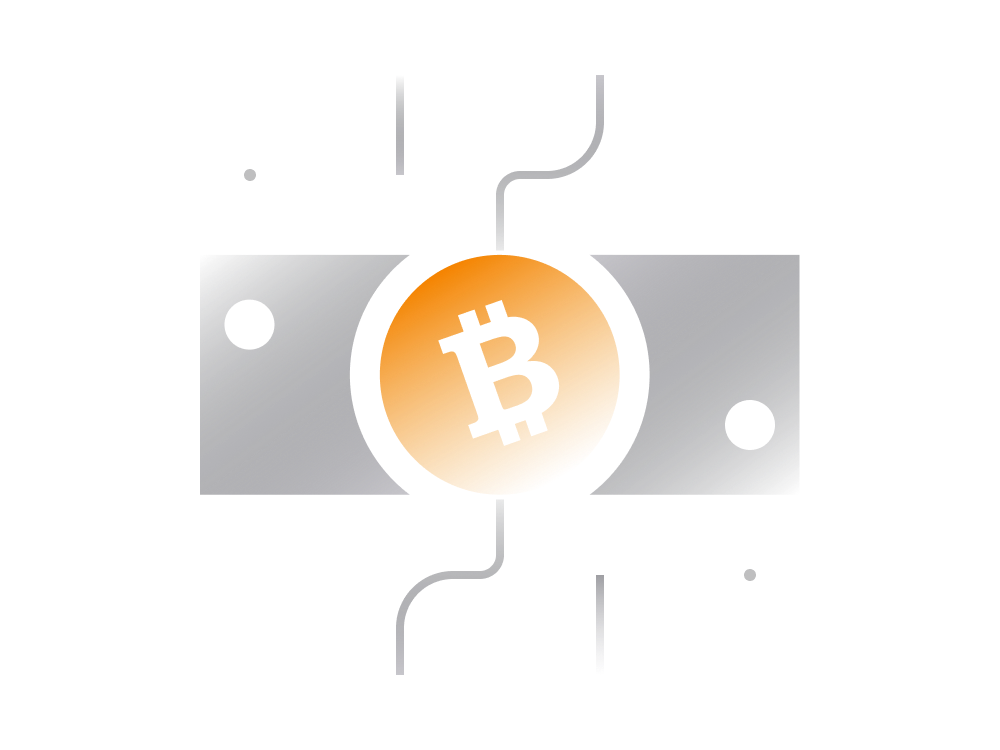

# Bitcoin Cash Demystified: A Comprehensive Guide for Beginners

Bitcoin Cash (BCH), represented by the symbol BCH, emerged as a distinct cryptocurrency in August 2017 through a fork from the original Bitcoin (BTC). This guide aims to unravel the origins of Bitcoin Cash, its relationship with Bitcoin, and the unique characteristics that set it apart.

## 1. Bitcoin Cash Genesis:

Bitcoin Cash shares its foundational elements with Bitcoin but operates on its own blockchain. The split occurred in 2017 due to a contentious debate within the Bitcoin community regarding the block size limit – a critical factor affecting transaction processing capacity.

## 2. Bitcoin vs. Bitcoin Cash:

Both Bitcoin and Bitcoin Cash now represent separate entities with different prices, blockchains, communities, and visions for the future. Each has its decentralized network, resources, and community-driven development.

**Official Websites:**
- Bitcoin Cash: [bitcoin.com](https://www.bitcoin.com/) / [bitcoincash.org](https://bitcoincash.org/)
- Bitcoin: [bitcoin.org](https://bitcoin.org/) / [bitcointalk.org](https://bitcointalk.org/)

## 3. Bitcoin Cash Origins and the Fork:

The genesis of Bitcoin Cash can be traced back to the Bitcoin community's attempt to address scalability issues. The primary disagreement revolved around increasing the block size limit. This division led to a split, resulting in the birth of Bitcoin Cash.

**Key Points:**
- Shared transaction history until the fork date (August 1, 2017).
- Equivalent capped supply of 21 million units.
- Users holding Bitcoin during the fork received an equal amount of Bitcoin Cash.

## 4. The Fork Explained:

A fork is a technical term in software engineering denoting the derivation of one software product from another. In this context, a fork occurs when the community cannot reach a consensus, prompting a split. Bitcoin Cash's fork was a demonstration of resolving ideological conflicts within an open-source cryptocurrency project.

## 5. Bitcoin Cash (BCH) vs. Bitcoin (BTC):

The ongoing debate between the Bitcoin and Bitcoin Cash communities revolves around which cryptocurrency is the "true" Bitcoin intended by Satoshi Nakamoto. While both share origins, post-fork changes directed each project differently.

**Bitcoin Cash (BCH):**
- Larger block size (up to 32 times more transactions).
- Faster transaction finality (considered final upon network entry).
- Lower transaction fees, making it suitable for everyday payments.

**Bitcoin (BTC):**
- Perceived as a "store of value."
- Emphasis on security and blockchain privacy.
- Transactions may take hours or even days to be considered final.

## 6. Network Metrics:

Comparing Bitcoin Cash and Bitcoin involves examining network nodes, hashrate, and active addresses. While Bitcoin Cash is considerably smaller, it remains significant compared to other cryptocurrencies.

## 7. Bitcoin Cash Highlights:

Bitcoin Cash offers unique features due to its larger block size and post-fork changes. These include instant confirmation, low transaction fees, decentralized storage capabilities, and the potential for smart contracts.

## 8. Bitcoin Cash Price:

Since its emergence, Bitcoin Cash has maintained a relatively stable price, while Bitcoin's price has exhibited greater volatility. The long-term price trajectory is expected to align with the growth of its blockchain network and community support.

## 9. Storage & Usage:

Practical involvement with Bitcoin Cash requires understanding cryptocurrency basics, wallet usage, private keys, secure storage, and transaction processes.

## Conclusion:

Bitcoin Cash, born out of a disagreement within the Bitcoin community, has evolved into a distinct cryptocurrency with its own set of characteristics and applications. As it continues to coexist with Bitcoin, exploring the unique features and potential uses of Bitcoin Cash can provide valuable insights for those entering the world of cryptocurrencies.

