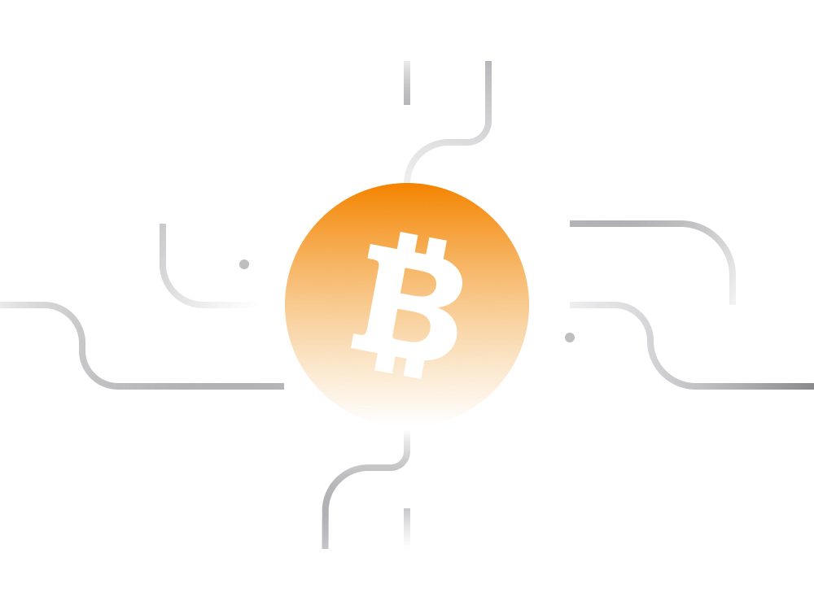

# Understanding Bitcoin: A Beginner's Guide

Newcomers to the cryptocurrency space often have numerous questions about Bitcoin. What is it? How does it work? What makes it special? This guide aims to provide simple and digestible answers to these questions, introducing you to Bitcoin in straightforward terms.

## 1. Bitcoin Origins:

Bitcoin, introduced by the mysterious Satoshi Nakamoto in 2008, was designed as a decentralized network for value exchange. Its key features include:

- Not reliant on any central entity.
- Functional and accessible 24/7.
- Enforces equal rules for all participants.
- Available to anyone unconditionally.
- Censorship-resistant.

## 2. Bitcoin Cryptocurrency:

Bitcoin's cryptocurrency, denoted as BTC, is the native unit of measurement on the Bitcoin blockchain. Key points:

- Limited supply: Eventually, there will be 21 million Bitcoins.
- Mining process: Approximately every 10 minutes, new Bitcoins are created through mining.
- Mining competition: Nodes compete to solve mathematical problems and add a new block to the blockchain.

## 3. Bitcoin As A Network:

Bitcoin is not just a cryptocurrency; it's a network and an open platform for commerce. The Bitcoin network includes:

- Parties running Bitcoin node software.
- Bitcoin mining facilities and pools.
- People accumulating Bitcoin in wallets.
- Participants in Bitcoin transactions.
- Engineers building services for Bitcoin.

## 4. Bitcoin Price:

Bitcoin's price has experienced significant growth and volatility. Despite starting as a niche for tech enthusiasts, Bitcoin has evolved into a global phenomenon with mainstream recognition.

## 5. Why Bitcoin is Growing:

Bitcoin's popularity is driven by its role as a solution to socioeconomic and geopolitical challenges. It provides an alternative to traditional financial systems, offering ownership and control over assets.

## 6. Is Bitcoin Stoppable?:

Bitcoin operates on a decentralized and resilient network. Attempts to ban Bitcoin would be challenging, as it relies on the widespread availability of electricity to function.

## 7. Bitcoin Problems:

Bitcoin faces challenges such as transaction speed, complexity for newcomers, and the need for increased adoption as a medium of exchange.

## 8. Bitcoin Forks:

Bitcoin has given rise to alternative cryptocurrencies, including forks like Bitcoin Cash. Other major cryptocurrencies (e.g., Ethereum) and tokens have also emerged.

## 9. Storage & Usage:

Practical aspects of Bitcoin involvement include understanding private keys, safe storage, and utilizing secure wallets. A Panaroma Decentralized Wallet is mentioned for further reference.

## 10. Address Formats:

Bitcoin has three commonly-used address formats: Legacy Address Format (P2PKH), Segwit Address Format (P2SH), and Native-Segwit Address Format (bech 32). Users need to be aware of the format for transaction purposes and wallet restoration.

## 11. Bitcoin Privacy:

Bitcoin transactions are semi-private. While transactions themselves are public, the identity of the sender or recipient is not directly revealed. Address reuse can compromise privacy, emphasizing the need for new addresses per transaction.

## Conclusion:

This guide provides essential information about owning and using Bitcoin. For those interested in deeper technical understanding, recommendations are made to explore advanced resources by experts like Andreas M. Antonopoulos.

