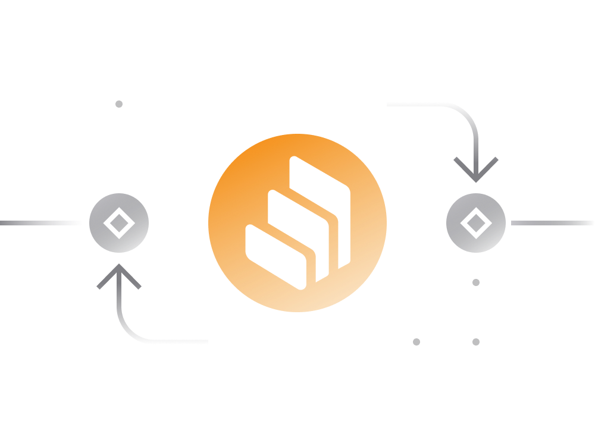

# Compound Explained Simply

[Compound](https://app.compound.finance) serves as a decentralized platform connecting cryptocurrency lenders and borrowers.

In simple terms, users deposit their idle cryptocurrency assets into the Compound Finance liquidity pool, allowing other users to borrow these assets.

- For cryptocurrency owners, Compound provides an opportunity to earn interest on deposits by locking them into a smart contract.

- Simultaneously, potential borrowers can request credit from Compound by paying a fee and providing collateral in the form of another cryptocurrency.

- Both regular users and smart contracts can engage in borrowing and lending, enabling DeFi engineers to create services accessing liquidity in various DeFi platforms.

Compound currently supports 8 cryptocurrencies:

- [Wrapped BTC (WBTC)](https://compound.finance/markets/WBTC)
- [Ethereum (ETH)](https://compound.finance/markets/ETH)
- [USD Coin (USDC)](https://compound.finance/markets/USDC)
- [Tether (USDT)](https://compound.finance/markets/USDT)
- [Dai (DAI)](https://compound.finance/markets/DAI)
- [Augur (Rep)](https://compound.finance/markets/REP)
- [0x (ZRX)](https://compound.finance/markets/ZRX)
- [Basic Attention Token (BAT)](https://compound.finance/markets/BAT)

Each supported cryptocurrency has specific borrowing and lending requirements on the platform:

- **Interest Rates:**
  - Borrowing/lending interest rates fluctuate in real time based on market supply and demand for the respective cryptocurrency asset.

- **Collateral Factor:**
  - The collateral factor determines the amount of collateral needed to borrow a certain cryptocurrency. For instance, a collateral factor of 70% means a user can borrow up to 70% of the collateral value.

By checking the individual asset pages on Compound (linked above), users can view details such as the total number of lenders, borrowers, and the available amount for borrowing. This information can be verified by examining the respective Compound smart contracts.

## Borrowing on Compound

To borrow on Compound, users must provide collateral in another cryptocurrency. The maximum borrowing amount depends on the 'reserve factor' for the collateral.

> For example, if a user supplies 100 DAI as collateral, and the collateral's reserve factor for DAI is 75%, the user can borrow up to 75 DAI worth of other assets.

Each asset on Compound may have a different collateral factor.

- Borrowing cryptocurrencies on Compound incurs fees in the form of borrowing interest rates.

- Compound employs floating interest rates adjusted based on market dynamics for each cryptocurrency.

- Once the loan is repaid, the account’s collateral can be fully withdrawn to an external wallet, either by the borrower or a third-party account.

However, borrowing involves risks, and collateral assets may be liquidated by the protocol under certain circumstances.

Borrowers need to monitor the price of collateral assets in real-time to ensure it stays above the minimum required for the loan.

> It is advisable to borrow less than the maximum allowed limit to safeguard against sharp drops in collateral asset prices.

A borrowing account becomes insolvent when the total borrowed balance exceeds the maximum allowed amount.

In case of insolvency, other platform users can repay a portion of the outstanding debt in exchange for a portion of the collateral, with a liquidation incentive — currently set at 8%, subject to change through the governance system. 

Experiencing liquidation is undesirable as it results in a loss of some or all of the collateral.

## Lending on Compound

- Lenders can withdraw their cryptocurrencies, along with earned interest, at any time with a 15-second lag.

- When users supply assets, they receive cTokens from Compound. These cTokens are ERC20 tokens redeemable for their underlying assets at any time.

- As interest accrues to the supplied assets, the exchange rate of cTokens to the underlying assets constantly increases over time, based on the interest rate earned.

- Lenders can also use the cTokens received to borrow assets from the platform.

Lending is not without risks; circumstances such as borrower default and liquidation malfunction can impact the safety of assets in the lending pool.

To protect lenders from unforeseen situations, Compound maintains a reserve pool funded by a small cut from the rate paid by lenders.

## cTokens 

cTokens are the primary means of interacting with the Compound Protocol. When users engage in actions such as minting, redeeming, borrowing, repaying a borrow, liquidating a borrow, or transferring cTokens, they do so using the cToken contract.

Each supported cryptocurrency on Compound has its respective cToken (e.g., cDAI for DAI, cUSDT for USDT).

When users supply assets, they receive cTokens from Compound, which are ERC20 tokens redeemable for their underlying assets at any time.

## Compound Governance

Since May 2020, Compound has shifted to community governance using its native COMP governance token.

> COMP holders can propose and vote on decisions related to Compound's operation, supported collateral assets, interest rates, and more.

There is a total supply of 10 million COMP tokens:

- 42.3% is reserved for distribution to active Compound users supplying or borrowing cryptocurrencies. On every Ethereum block, 0.5 COMP is distributed across Compound’s lending and borrowing pools.

- Distributed tokens are split 50:50 between suppliers and borrowers of that specific cryptocurrency.

- Users can also earn $COMP by voting on various governance proposals.

Compound is on a path towards decentralizing all aspects of the platform. Further details about the transition can be found [here](https://medium.com/compound-finance/expanding-compound-governance-ce13fcd4fe36).

## Links

- [Official Compound Website](https://compound.finance)
- [Governance Proposals](https://compound.finance/governance/proposals)
- [Compound Owners Leaderboard](https://compound.finance/governance/leaderboard)
- [Project Documentation](https://compound.finance/docs)
