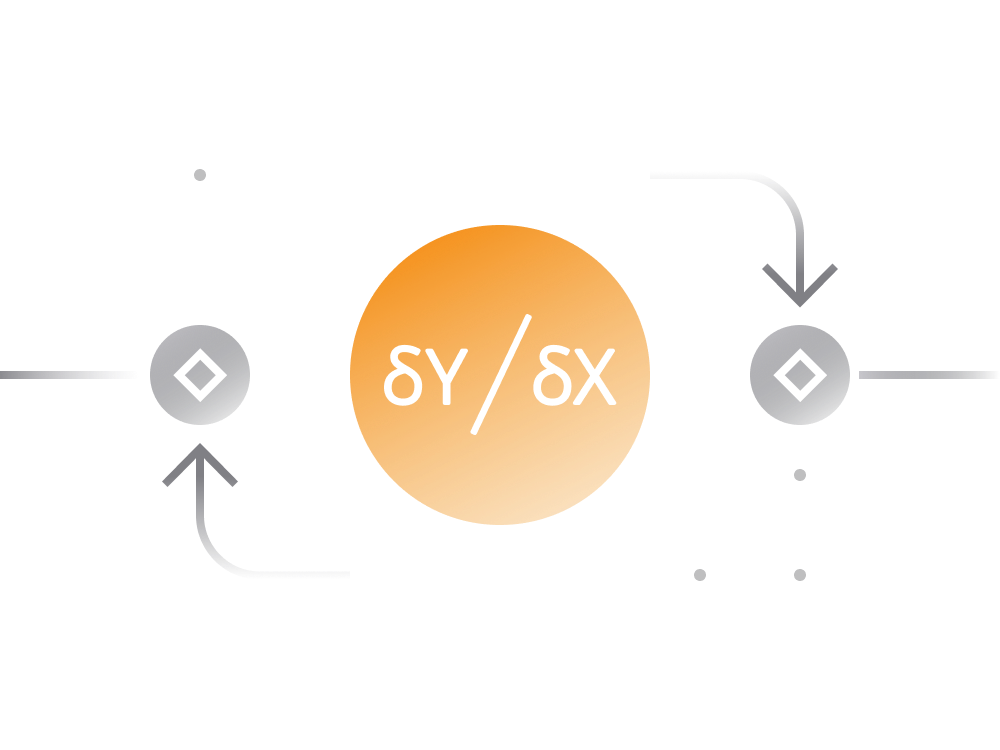

### 6. dYdX DEX

Most decentralized exchange (DEX) platforms enable investors to take long positions in various cryptocurrency assets. However, taking short, hedged, or more complex financial positions is often challenging.

[dYdX](https://dydx.exchange/) is a decentralized exchange designed for short selling and derivatives, operating on the Ethereum blockchain.

- **Short Positions:** Investors can use dYdX to take short positions, allowing them to profit from price decreases. This feature can be utilized for speculation or to hedge existing positions.

- **Fully-Collateralized Low-Risk Loans:** dYdX offers fully-collateralized low-risk loans for short sellers. Token holders can earn interest fees by providing collateral for short positions.

- **Margin Trading with Leverage:** On dYdX, users have the ability to trade on margin with up to 10x leverage. Positions can be backed by any supported collateral.

For more information, you can visit the [dYdX website](https://dydx.exchange/).

