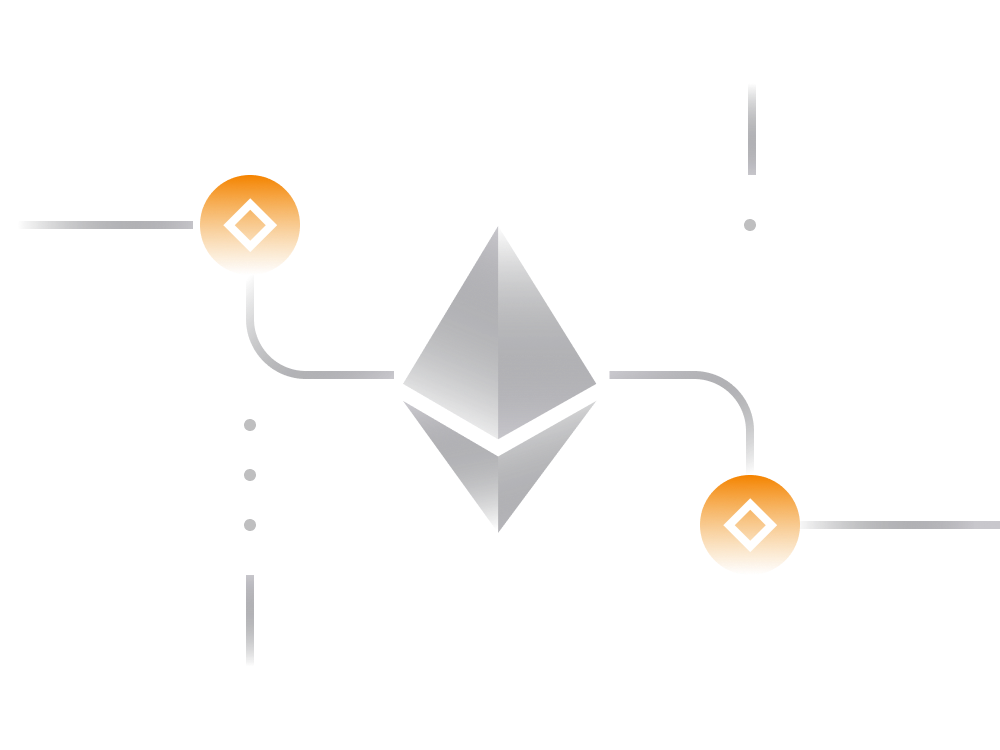

# Ethereum Unveiled: A Comprehensive Guide for Beginners 

Often paired with Bitcoin, Ethereum stands out as a leading decentralized cryptocurrency, offering a unique approach to blockchain technology. This guide delves into Ethereum's origins, distinctive features, applications, and challenges, providing a comprehensive introduction for those venturing into the world of decentralized finance. 

## 1. Ethereum's Genesis: 

Proposed in 2013 and gaining prominence in 2015, Ethereum was conceptualized by Vitalik Buterin and co-developers. It differentiates itself from Bitcoin by presenting a new paradigm for blockchain applications. 

## 2. Decoding Ethereum's Purpose: 

While Bitcoin primarily facilitates value transfers, Ethereum serves as a platform for decentralized services. Imagine a global computer accessible to everyone, open for participation, and resistant to censorship. 

## 3. Why Ethereum Matters: 

Ethereum's appeal lies in its openness and trustlessness. Anyone can utilize the platform to host decentralized services, ensuring permanence, accessibility, and transparency. This is particularly valuable for services where reliability is paramount, such as lotteries or voting apps. 

## 4. Ethereum Blockchain Basics: 

Underlying Ethereum is a blockchain, a comprehensive record of all transactions and actions on the network. Every Ethereum node validates transactions, ensuring a consensus among nodes and securing the network. 

## 5. Ether Currency: 

Similar to Bitcoin's BTC, Ether (ETH) is Ethereum's native cryptocurrency. Ether is essential for transaction fees within the Ethereum network, and its value has risen over the years. Unlike Bitcoin, there is no cap on the total supply of Ether. 

## 6. Ethereum as a Network: 

Ethereum is not just a cryptocurrency; it's a network and an open decentralized platform for various services. Its expansive ecosystem attracts engineers and entrepreneurs globally, fostering continuous growth. 

## 7. Smart Contracts: 

Smart contracts, the cornerstone of Ethereum, are self-executing contracts with coded terms. They automate contractual agreements, ensuring transparent and irreversible execution. This feature distinguishes Ethereum by enabling a wide array of services beyond simple currency transfers. 

## 8. Decentralized Applications (DApps): 

DApps are services built using smart contracts. Unlike centralized apps, DApps operate on a distributed structure, safeguarding against censorship and central control. Ethereum hosts numerous DApps, ranging from financial services to decentralized finance (DeFi) applications. 

## 9. DApps Ecosystem: 

The Ethereum ecosystem thrives on versatility. Thousands of DApps, some handling over a billion USD in value, demonstrate the potential applications on the platform. Notable DApps include MakerDAO, 0x Protocol, and Basic Attention Token. 

## 10. Challenges Facing Ethereum: 

Despite its successes, Ethereum faces challenges, including scalability issues, complexity for newcomers, and privacy concerns. Addressing these challenges is crucial for Ethereum's sustained growth. 

## 11. Privacy on Ethereum: 

Privacy on Ethereum is a current limitation. Transactions are transparent, revealing balances and transaction histories. Ethereum addresses are static, potentially compromising user privacy. Ongoing efforts aim to enhance privacy features. 

## 12. Getting Started with Ethereum: 

For those ready to engage with Ethereum, guides on cryptocurrency fundamentals, wallet usage, private keys, and secure storage are essential prerequisites. 

**Conclusion:**

This guide provides a foundational understanding of Ethereum, its significance, and the multitude of decentralized applications it hosts. As Ethereum continues to evolve, further exploration into its vast ecosystem awaits those embarking on this exciting journey into decentralized finance.
