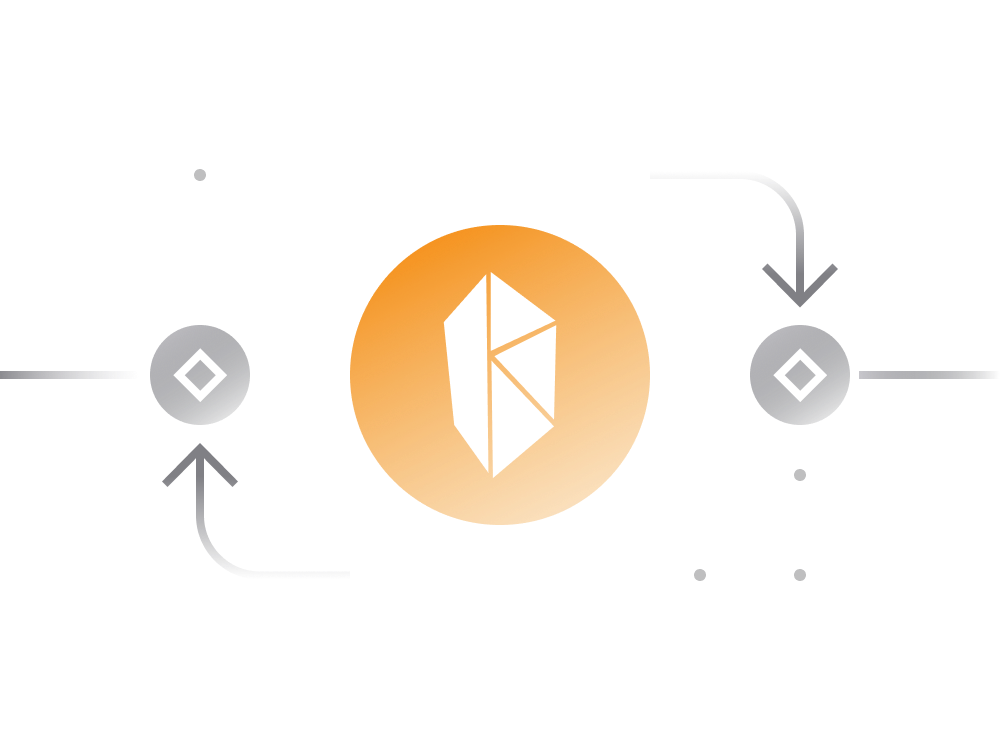

# 4. Kyber DEX

[Kyber](https://kyberswap.com/) DEX made its debut in 2017, successfully raising around $50 million through its ICO sale of the KNC token, with Vitalik Buterin (Ethereum's founder) serving as an advisor.

## For Traders:

- Users seeking to exchange Ethereum-based tokens will find a distinct feature in the ability to place limit orders.
  
- A limit order ensures executing a trade at a price that is guaranteed to be higher or equal to a specific rate, so you don't have to monitor the crypto market 24x7 to swap manually.

## Highlights:

- Various DeFi service DApps already integrate with Kyber and use it for various purposes. For instance, an app looking to accept payments in some cryptocurrency stablecoin may use Kyber to accept payments in various cryptocurrencies and have them auto-converted to a desired one.

- Kyber has a native cryptocurrency token KNC which is a governance token for KyberDAO. Right now the KNC token can be used for voting on important decisions and in the future all aspects of the platform are to be decided by KNC owners.
