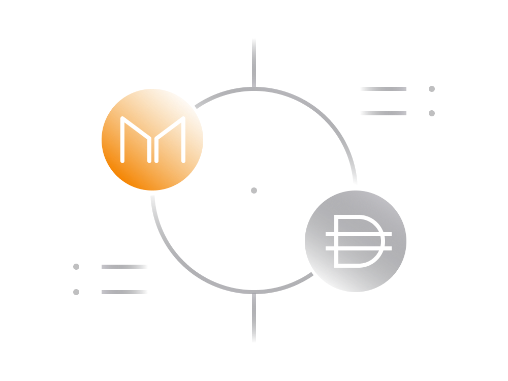

# MakerDAO & DAI Explained Simply

## 1. Introduction to Decentralized Finance (DeFi):

Bitcoin initiated decentralized finance by allowing peer-to-peer transactions without intermediaries. Ethereum expanded this idea, enabling complex contractual agreements, leading to the birth of DeFi. DeFi commonly refers to financial services on the Ethereum blockchain.

## 2. MakerDAO Overview:

MakerDAO, a pioneer in DeFi, controls over half a billion USD through the Maker Protocol. Operating as a Decentralized Autonomous Organization (DAO), MakerDAO enables decentralized lending on Ethereum.

### - Smart Contracts:

MakerDAO relies on smart contracts, transparent computer programs on the blockchain. Anyone can verify their functionality.

### - DAO Governance:

Governed by MKR token holders, MakerDAO operates as a DAO. Voting on proposals by MKR holders determines changes in the Maker Protocol.

## 3. DAI Stablecoin:

DAI, the core product of MakerDAO, is a stablecoin pegged close to 1 USD. It is generated through the Maker Protocol's lending facility.

### - Collateralized Lending:

Users lock Ether tokens as collateral, enabling them to borrow DAI. The collateral ensures the stability and trustless nature of DAI.

### - DAO Governance Impact:

MKR token holders influence stability fees, impacting borrowing costs. This dynamic helps control DAI's value and stability.

## 4. DAI Savings Rate (DSR):

Introduced in 2019, DSR allows users to earn interest by depositing DAI. The interest is paid from Stability Fees collected by the Maker Protocol.

### - Interest Rates:

DSR rates fluctuate based on governance decisions. Users can earn interest on their DAI holdings.

## 5. Governance and MKR Tokens:

MKR token holders play a crucial role in MakerDAO's governance, voting on proposals and influencing decisions.

### - Risk and Reward:

MKR holders benefit from the growth of MakerDAO but share financial risks. Governance decisions affect MKR's value.

## 6. MakerDAO Services:

MakerDAO provides services like the Oasis decentralized exchange, borrowing DAI through Maker Vaults, and earning interest through DSR.

### - Oasis Exchange:

A decentralized platform for token exchange, operating on Ethereum. Users can deposit/withdraw funds using supported wallets.

### - Borrowing DAI:

Users lock collateral to create Maker Vaults, borrowing DAI against it. Collateralization ratio, liquidation, and stability fees are key aspects.

### - Lending DAI:

Introduced in 2019, users can deposit DAI in Maker Protocol, earning interest through DSR.

## 7. DAI Stability Control:

MakerDAO ensures DAI's stability around 1 USD through mechanisms like adjusting DSR, stability fees, and controlling collateral.

### - Price Increase:

MakerDAO may increase DSR and stability fees to boost DAI demand and reduce supply.

### - Price Decrease:

Lowering DSR and stability fees can decrease DAI demand and increase supply, stabilizing its price.

## 8. MKR Token Value and Governance:

MKR token value is tied to governance influence. Poor governance can dilute MKR value, and MKR holders cover Maker Protocol losses.

### - Reducing MKR Supply:

As MakerDAO grows, fees collected can be used to buy and destroy MKR tokens, potentially reducing the supply.

## 9. Challenges and Uncertainties:

While MakerDAO is a successful DeFi project, uncertainties like software bugs, Ethereum issues, and unforeseen events pose potential risks.

## Conclusion:

MakerDAO's innovative approach to decentralized lending and stablecoin creation has established it as a significant player in the DeFi space. While its governance model and mechanisms have shown success, ongoing challenges and uncertainties in the crypto space remain. Users and investors should consider the evolving nature of DeFi and MakerDAO's response to potential risks.

