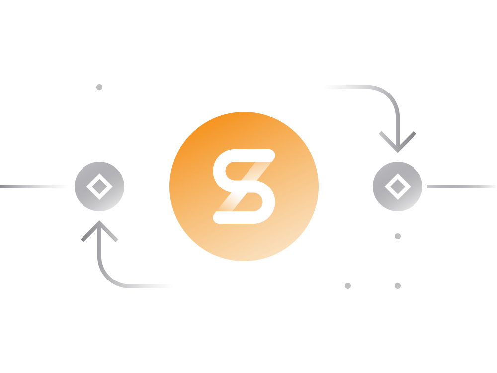

# Synthetix in Simple Terms

## Introduction:

**Decentralized Platform:** Synthetix operates as a decentralized platform on Ethereum for trading synthetic assets known as Synths.

**Synths Definition:** Synths are ERC-20 token representations of various assets such as cryptocurrencies, stocks, fiat currencies, and precious metals.

**Price Copying:** Synths mimic the price of the underlying assets while excluding other properties.

## Asset Trading:

**Trading Purpose:** Users can trade Synths to gain exposure to the price movements of various financial instruments without owning the actual assets.

**Transfer and Trading:** Synths are transferable and tradable on decentralized exchanges within the Ethereum ecosystem.

## Supported Synths:

**Synth Variety:** Synthetix supports a variety of synths, representing cryptocurrencies, stocks, precious metals, and more.

**Examples:** sUSD (synthetic USD), sBTC (synthetic Bitcoin), sETH (synthetic Ether), sAAPL (synthetic Apple stock), etc.

**Two Types:** Standard Synths (follow asset price) and Inverse Synths (profit inversely to asset price depreciation).

## Creating Synths:

**Collateralization:** Users can create Synths by locking their SNX (Synthetix Network Token) tokens as collateral.

**Ratio:** Approximately 600% SNX collateral to the value of the sUSD synth being minted.

**Minting Process:** After collateralization, users can mint sUSD tokens, which can be traded on Synthetix Exchange.

## Synthetix.Exchange:

**Decentralized Exchange:** Synthetix has its decentralized exchange, Synthetix.Exchange.

**Market Prices:** All orders are executed at market prices within seconds, eliminating the need for order books or liquidity pools.

**Trading Fees:** Fees range from 0.1% to 1%, with fees going to entities creating sUSD tokens as collateral.

## Incentives for Creating Synths:

**SNX Stakers' Rewards:** Entities creating synths and staking SNX tokens receive staking rewards generated through the inflationary monetary policy of SNX.

**Exchange Fees:** Stakers can claim a portion of the fees collected from Synthetix.Exchange transactions.

## Synthetix Stats (as of September 9, 2020):

**Total Locked:** $650.2 million (USD), 1.9 million ETH, 63.3 thousand BTC, 141 million SNX.

**Percentage of SNX Supply Locked:** 70.36%.

## Role of SNX Stakers:

**Debt and Counterparty Role:** SNX stakers act as a pooled counterparty to all Synth exchanges, taking on the risk of the overall debt in the system.

**Debt Mechanism:** Stakers' debts are created based on the initial minting of sUSD and are adjusted according to price gains or losses made by all Synth assets.

## Why Trade Synths:

**Cost-Effective:** Trading Synths is often cheaper compared to trading actual assets.

**Convenience:** Synths provide a convenient way to gain exposure to any tradable asset globally on the Ethereum blockchain.

## Future Expectations:

**Asset Expansion:** As Synthetix continues to grow, more synthetic assets representing various assets are likely to be added to the platform.

Synthetix provides a decentralized and versatile platform for users to engage in synthetic asset trading, offering exposure to diverse financial instruments.

