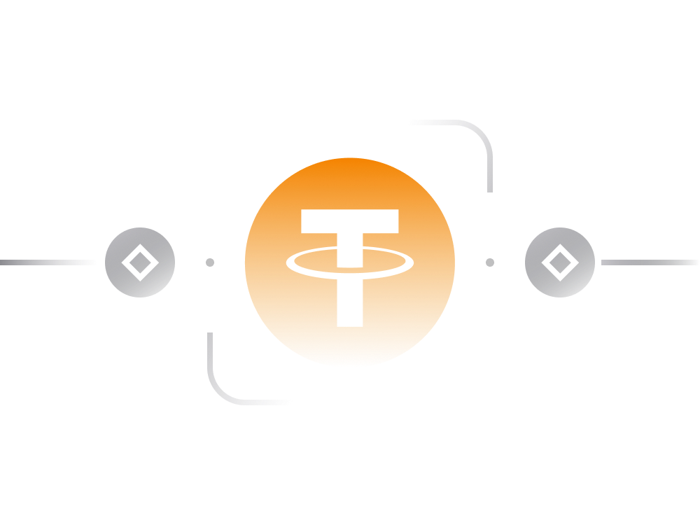

# Understanding Tether (USDT) in Simple Terms

## Introduction:
Tether (USDT) is a prominent cryptocurrency stablecoin designed to maintain a value pegged to the US dollar. As the largest stablecoin in the crypto space, Tether facilitates easy exposure to USD and is widely supported on various exchanges and crypto wallets.

## Key Points:
**Symbol and Trading:** Tether is denoted by the symbol USDT and is frequently traded on cryptocurrency exchanges. Notably, it is commonly paired with other cryptocurrencies, with significant daily trading volumes.

**Market Capitalization:** The market capitalization of Tether has consistently grown, surpassing 8 billion USD in May 2020. While Tether tokens are issued on multiple blockchains, the majority exists on the Ethereum blockchain.

## Use Cases:
**Trading Stability:** Tether is primarily used by crypto traders to mitigate volatility. Traders can convert their crypto holdings into Tether, providing a stable value equivalent to the US dollar.

**Storage of Assets:** Individuals use Tether to store assets in USD equivalent on exchanges or non-custodial wallets without the need for a traditional bank account.

**Fiat-Crypto Trading:** For exchanges, Tether enables cryptocurrency-to-fiat trading without relying on traditional banking, offering faster transactions compared to legacy systems.

## Blockchain and Anonymity:
Tether tokens exist as cryptocurrency tokens, primarily on the Ethereum blockchain. This provides a level of pseudo-anonymous transacting between parties.

Transactions with Tether can be conducted without revealing the identity of the sender, requiring only a crypto wallet that supports Tether tokens.

## Acquisition and Redemption:
Users can purchase Tether tokens directly from Tether's website or crypto exchanges using fiat money or other cryptocurrencies. Similarly, users can redeem Tether tokens into fiat currency.

## Reliability and Risks:
**Centralized Nature:** Tether is a centralized stablecoin, requiring a high level of trust in the issuer, Tether Limited. It is not fully transparent or trustless like decentralized stablecoins such as DAI.

**Comparison with DAI:** Unlike DAI, a decentralized stablecoin, Tether relies on trust in the company issuing it. DAI, governed by pre-programmed code, doesn't require trust in an entity.

## Risks and Controversies:
**Bankruptcy Concerns:** Tether Limited may go bankrupt, posing risks to Tether holders. The compensation process in such a scenario is unclear.

**Banking Issues:** Banking challenges, such as freezes on Tether Limited's access to its accounts, can impact Tether's reliability.

**Trust and Transparency:** Tether Limited claims that all Tether tokens are 100% backed by cash and liquid assets. However, verifying the actual reserves and transparency remains a challenge.

## Conclusion:
While Tether serves as a popular stablecoin with widespread use in the cryptocurrency trading ecosystem, users must be aware of its centralized nature and associated risks. Trust in Tether Limited, concerns about reserves, and potential external factors impacting operations should be considered when using Tether tokens. Users seeking a decentralized and trustless stablecoin may explore alternatives like DAI.

