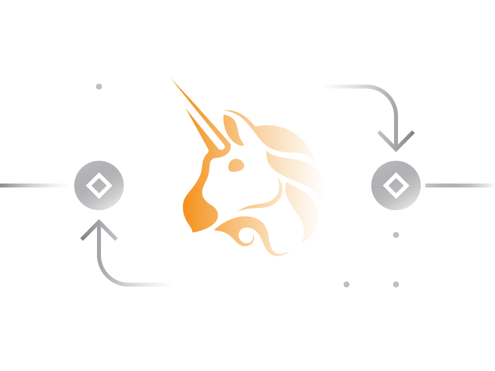

# Uniswap in Simple Terms

## 1. Introduction:

**Nature:** Uniswap is a decentralized cryptocurrency exchange designed for Ethereum and Ethereum-based tokens.

**Decentralization:** Considered genuinely decentralized, Uniswap's smart contracts operate autonomously without the ability for exchange operators to censor users or shut it down.

**Prominence:** It is among the largest decentralized exchanges (DEX) with a high trading volume, surpassing many centralized exchanges.

## 2. Trading on Uniswap:

**Access:** Users can access Uniswap's trading interface through [uniswap.org](https://uniswap.org/).

**Service Fee:** A 0.03% service fee is charged for executing transactions on Uniswap.

**Cost-Efficient:** Trading between Ethereum's native ETH and ERC20 tokens is generally more cost-effective than exchanging between different ERC20 tokens.

**Transaction Fees:** Uniswap's smart contract design enables lower Ethereum transaction fees compared to other decentralized exchanges.

**Price Slippage:** Larger orders may experience significant price slippage, and liquidity pool size influences trading prices.

**Liquidity Pools:** Larger liquidity pools facilitate better prices for larger trades.

## 3. Liquidity Providers:

**Automated Market Making:** Uniswap introduced automated market making through liquidity pools.

**Pool Creation:** Anyone can create or join a liquidity pool for a specific trading pair by depositing two tokens in equal amounts.

**Earnings:** Liquidity providers earn a share of trading fees proportional to the value of their deposited assets.

**Ownership Tokens:** Liquidity providers receive tokens representing ownership of assets in the pool and can withdraw assets along with earnings at any time.

## 4. Pool Profitability:

**Formula:** Uniswap uses a formula to govern trading, influencing liquidity provider earnings.

**Asset Value Changes:** The value of a liquidity provider's stake may decrease due to changes in the price of deposited assets, impacting returns.

**Recommendation:** Liquidity pools may perform better for pairs involving stable assets (stablecoins) due to their price stability.

## 5. Uniswap Token (UNI):

**Introduction:** Uniswap introduced its native governance token, UNI, in September 2020.

**Use Cases:** UNI is utilized for participating in decision-making processes and governance aspects of Uniswap, including the community-managed treasury.

## 6. Conclusion:

**Significance:** Uniswap plays a crucial role in the DeFi ecosystem as a decentralized exchange, providing users with opportunities for trading, liquidity provision, and governance participation.

**Ongoing Development:** Uniswap continues to evolve, with ongoing improvements, the introduction of new versions (Uniswap V3), and active community participation through the UNI governance token.
