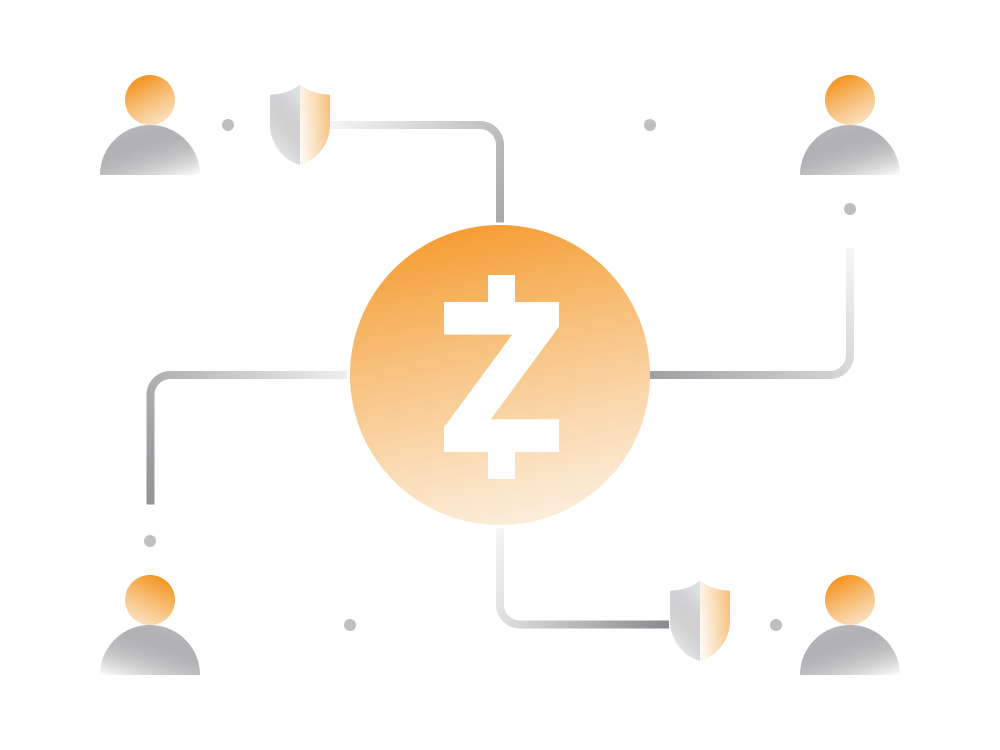

# Zcash Origins

## 1. Zcash Origins

Zcash (ZEC) was created to address the lack of privacy in Bitcoin transactions. It launched in 2016 with a focus on privacy, using zero-knowledge proofs (zk-SNARKs) to enable transactions that are verifiable without revealing details about the sender, receiver, or amount.

## 2. Zcash vs Bitcoin

Zcash is a fork of Bitcoin, sharing fundamental properties such as a limited supply of 21 million ZEC tokens. Unlike Bitcoin, Zcash allows users to choose between transparent and shielded transactions, providing enhanced privacy. It offers selective disclosure for transparency when needed.

## 3. Zcash Privacy

Zcash has two types of addresses: transparent (starting with "t") and shielded (starting with "z"). Fully shielded transactions provide complete privacy, while transparent transactions resemble Bitcoin transactions. Users can send funds between different address types. Zcash offers varying levels of privacy for different transaction types.

## 4. Zcash Ecosystem

Zcash is an open-source project with contributions from a community of cryptographers, activists, and developers. Key entities include Electric Coin Company (ECC) and Zcash Foundation, which support development and maintenance. The Major Grant Review Committee promotes decentralization through grants.

## 5. Why Zcash is Growing

Zcash addresses the privacy concerns of cryptocurrency users, offering fully confidential transactions. Privacy-conscious users are attracted to Zcash, given its strong fundamentals and backing by key figures in the crypto space. The need for privacy coins is increasing as other major cryptocurrencies struggle with privacy issues.

## 6. Zcash Challenges

Challenges include the trusted setup for privacy technology, which raises concerns about potential misuse. Zcash's shielded adoption is still relatively low, with most transactions being transparent. The blockchain speed is limited, and competition from other privacy-focused cryptocurrencies like Monero and DASH exists.

In summary, Zcash stands out for its privacy features, allowing users to choose between transparent and fully shielded transactions. While it faces challenges, its unique approach to privacy continues to attract users seeking confidential and secure transactions.

The fact that it has a strong fundamentals and backing of some of the brightest people in the cryptocurrency space attracts a lot of people to these privacy preserving cryptocurrency.

## 6. Zcash Challenges

As the case for nearly every cryptocurrency out there, Zcash has some issues which may inhibit its future growth.

- Trusted Set up

    Privacy technology implemented by Zcash currently rely on a so called 'trusted setup', which is used to form the initial parameters that allow network users to construct and verify private transactions. 

    While there are measures in place to prevent malicious behavior, Zcash research team has been working on [Halo](https://electriccoin.co/blog/explaining-halo-2/), which can potentially remove the need for trusted set up.

    Critics have suggested that the founders could potentially use this facet of the system to create an infinite number of Zcash tokens without anyone else being aware of the existence of those tokens. For that reason, it's not entirely possible to know the exact number of zcash tokens in existence at this point.

- Shielded Adoption

    The percentage of shielded transactions on the Zcash network remains low compared to total usage. Most transactions on Zcash are as transparent as on Bitcoin. 
    
    That said, Zcash has made significant progress toward the growth of shielded adoption including getting the support from major cryptocurrency exchanges.

- Blockchain Speed

    While Zcash blockchain can potentially process more transactions than Bitcoin it's still limited to roughly 20 transactions per second. 
    
    This is not an issue as such for the time being as the current activity on Zcash is significantly below the limit.
    
- Competition

    Another potential issue for Zcash is existence of competing cryptocurrencies, specifically DASH and Monero which are also trying to tackle the issue of privacy.
    
    While Monero currently being the one with the highest market cap it's yet to be seen which one will attract the most users in the long run. 
    
From users' perspective we are hopeful Zcash continues to grow and becomes the defacto privacy coin for those looking to abide regulations and at the same time have on demand privacy.
